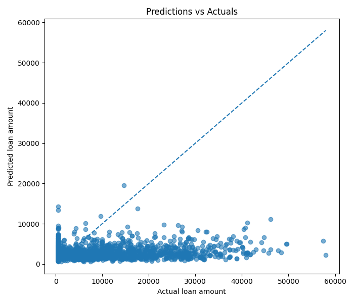

# Loan Management API

Projet réalisé avec FastAPI, SQLAlchemy, PostgreSQL et TensorFlow pour modéliser des clients, leurs informations de prêt, puis entraîner un réseau de neurones pour prédire `loan_amount`.

Cette version étend le pipeline initial pour intégrer de nouvelles colonnes issues du fichier source, faire évoluer le schéma relationnel avec Alembic et préparer une séparation claire entre données stockées en base et données réellement utilisées pour l'entraînement du modèle.

## Objectifs

- modéliser les données métier avec SQLAlchemy ORM
- exposer une API REST documentée automatiquement avec Swagger
- importer et nettoyer un jeu de données CSV dans PostgreSQL
- intégrer de nouveaux attributs clients sans casser l'API existante
- documenter les choix de nettoyage, de stockage et de sélection des variables
- entraîner un modèle de réseau de neurones sur les données stockées en base

## Stack technique

- Python 3.11
- FastAPI
- SQLAlchemy
- Alembic
- PostgreSQL
- pgAdmin
- Pandas
- Scikit-learn
- TensorFlow / Keras
- Matplotlib

## Structure du projet

```text
.
├── api/
│   └── routes/
├── artifacts/
├── config/
├── data/
├── migrations/
├── ml/
├── models/
├── schemas/
├── scripts/
├── docker-compose.yml
├── main.py
└── requirements.txt
```

## Documentation du brief

Le livrable documentaire principal est le notebook `docs/brief_analysis.ipynb`.

Il regroupe dans un meme support :

- l'analyse exploratoire des fichiers recus
- l'etude de la qualite des donnees
- les choix de nettoyage et de transformation
- la compatibilite entre `data/raw_data.csv` et `data/raw_data_2.csv`
- l'explication du flux de donnees vers la base, l'API et le modele
- la justification ethique de la selection finale des variables d'entrainement
- la comparaison des performances du modele avant et apres les derniers ajustements

## Modélisation

Le projet repose sur deux entités principales :

- `Client`
- `LoanInformation`

Relation :

- un client peut être lié à plusieurs `loan_informations`

Contraintes :

- `clients.id` : clé primaire
- `loan_informations.id` : clé primaire
- `loan_informations.client_id` : clé étrangère vers `clients.id`

### Nouvelles colonnes intégrées

Les nouvelles données reçues via le CSV sont stockées dans la table `clients` :

- `sexual_orientation`
- `caf_quotient`
- `child_count`

Ces colonnes sont intégrées dans la base afin de conserver la richesse des données reçues et de garder une traçabilité complète de l'ingestion.

### Choix éthique

Le stockage en base de données et l'utilisation pour l'entraînement du modèle sont traités comme deux décisions distinctes :

- la base conserve les colonnes reçues après nettoyage et normalisation
- l'API peut limiter les champs exposés selon les besoins métier
- le pipeline ML applique une sélection explicite des variables autorisées pour l'entraînement

En particulier, les attributs sensibles comme `sexual_orientation` peuvent être stockés à des fins d'analyse ou de traçabilité, mais doivent être justifiés, contrôlés et exclus du modèle prédictif si leur usage crée un risque éthique ou réglementaire.

## Lancement du projet

### 1. Installer les dépendances

```bash
pip install -r requirements.txt
```

### 2. Lancer PostgreSQL et pgAdmin

```bash
docker compose up -d
```

Accès pgAdmin :

- URL : `http://localhost:5050`
- Email : `admin@example.com`
- Mot de passe : `admin`

### 3. Appliquer les migrations

```bash
alembic upgrade head
```

### 4. Importer les données CSV

```bash
python -m scripts.import_raw_data
```

Le script :

- charge `data/raw_data.csv` et `data/raw_data_2.csv`
- harmonise les colonnes manquantes entre ancien et nouveau format
- supprime les lignes trop incomplètes
- supprime les lignes sans cible `montant_pret`
- impute certaines colonnes numériques par la médiane
- impute certaines colonnes catégorielles par la valeur la plus fréquente
- intègre les nouvelles colonnes `orientation_sexuelle`, `quotient_caf` et `nb_enfants`
- laisse la base gérer les colonnes absentes avec `NULL` quand la source ne les contient pas
- convertit `nb_enfants` en entier non négatif avant insertion
- borne `quotient_caf >= 0`
- borne `loyer_mensuel >= 0`
- insère les données nettoyées dans PostgreSQL

### Colonnes prises en charge depuis le CSV

#### Données client

- identité : `nom`, `prenom`
- profil : `age`, `taille`, `poids`, `sexe`
- statut : `sport_licence`, `niveau_etude`, `region`, `smoker`, `nationalité_francaise`, `situation_familiale`
- nouvelles colonnes : `orientation_sexuelle`, `quotient_caf`, `nb_enfants`

#### Données de prêt

- `revenu_estime_mois`
- `historique_credits`
- `risque_personnel`
- `date_creation_compte`
- `score_credit`
- `loyer_mensuel`
- `montant_pret`

### Logique de nettoyage appliquée

- suppression des lignes dont le taux de valeurs manquantes dépasse `20%`
- suppression des lignes sans colonnes essentielles
- conversion typée des colonnes numériques, booléennes et catégorielles
- imputation numérique par médiane
- imputation catégorielle et booléenne par mode
- conversion de `date_creation_compte` en date
- normalisation de `nb_enfants` en entier positif ou nul
- bornage de `quotient_caf` à une valeur minimale de `0`
- bornage de `loyer_mensuel` à une valeur minimale de `0`

### 5. Lancer l'API

```bash
uvicorn main:app --reload
```

Accès API :

- API : `http://127.0.0.1:8000`
- Swagger : `http://127.0.0.1:8000/docs`
- ReDoc : `http://127.0.0.1:8000/redoc`

## Routes principales

### Clients

- `GET /clients`
- `GET /clients/{client_id}`
- `POST /clients`
- `DELETE /clients/{client_id}`

### Loan informations

- `GET /loan_informations`
- `GET /loan_informations/{loan_information_id}`
- `DELETE /loan_informations/{loan_information_id}`

## Entraînement du modèle

Le modèle prédit :

- `loan_amount`

### Variables retenues pour l'entraînement

Afin de limiter les risques éthiques et de ne garder que les variables jugées utiles au métier, l'entraînement repose uniquement sur les colonnes suivantes :

- `age`
- `estimated_monthly_income`
- `credit_history_count`
- `personal_risk_score`
- `credit_score`
- `monthly_rent`
- `caf_quotient`

### Préprocessing retenu pour le modèle

Le pipeline final d'entraînement applique les choix suivants :

- imputation des variables numériques avec `KNNImputer(n_neighbors=5, weights="distance")`
- standardisation avec `StandardScaler`
- transformation de la cible avec `log1p(loan_amount)` pour réduire l'effet des montants extrêmes
- retour à l'échelle réelle avec `expm1` au moment d'évaluer les prédictions

Ce choix permet d'améliorer l'apprentissage sur une cible très asymétrique tout en gardant des métriques finales exprimées en euros.

### Variables exclues du modèle

Les autres colonnes disponibles en base ne sont pas utilisées pour l'entraînement, soit parce qu'elles sont peu pertinentes pour la prédiction métier, soit parce qu'elles introduisent un risque de biais ou de sensibilité inutile.

Exemples de colonnes exclues :

- données d'identité : `first_name`, `last_name`
- données sensibles : `sexual_orientation`
- variables socio-démographiques non retenues : `sex`, `region`, `family_status`, `child_count`
- métadonnées techniques : `id`, `client_id`, `created_at`, `account_created_at`

Cette séparation permet de conserver une base complète pour l'ingestion, tout en gardant un pipeline d'entraînement plus sobre, explicable et défendable.

### Lancer l'entraînement

```bash
python -m ml.train
```

### Artefacts générés

- `artifacts/loan_amount_model.keras`
- `artifacts/metrics.json`
- `artifacts/loss_curve.png`
- `artifacts/predictions_vs_actuals.png`
- `artifacts/outlier_summary.json`
- `artifacts/pgadmin.png`

### Métriques obtenues

- `train_loss`: `2.6409549713134766`
- `val_loss`: `2.7058091163635254`
- `test_loss`: `131822422.41418736`
- `test_mae`: `7169.412390309361`
- `prediction_count`: `2209`
- `target_transform`: `log1p`
- `imputer`: `KNNImputer(n_neighbors=5, weights='distance')`

Important : `train_loss` et `val_loss` sont désormais calculées dans l'espace transformé `log1p`. Elles ne sont donc plus directement comparables aux anciennes losses brutes ; la comparaison métier la plus lisible reste `test_mae` en euros.

### Interprétation des résultats

- le pipeline d'entraînement fonctionne de bout en bout et génère bien tous les artefacts attendus
- l'usage de `log1p` améliore l'erreur absolue moyenne sur l'échelle réelle par rapport à la version précédente la plus récente
- les erreurs quadratiques restent élevées, ce qui montre que les valeurs extrêmes de `loan_amount` continuent de peser fortement sur le modèle
- un travail complémentaire sur les outliers et éventuellement sur un modèle tabulaire alternatif pourrait encore améliorer les performances

## Captures

### Courbe de loss


### Predictions vs actuals



## Remarques

- `date_of_birth` est laissé vide lors de l'import du CSV brut
- l'âge est utilisé comme variable présente dans les données
- les nouvelles colonnes sont stockées en base, mais leur exposition API et leur usage ML doivent être décidés explicitement
- `sexual_orientation` est une donnée sensible : son stockage doit être justifié et son exclusion du modèle est recommandée
- la comparaison avant / après entraînement final est documentée dans `docs/brief_analysis.ipynb`
