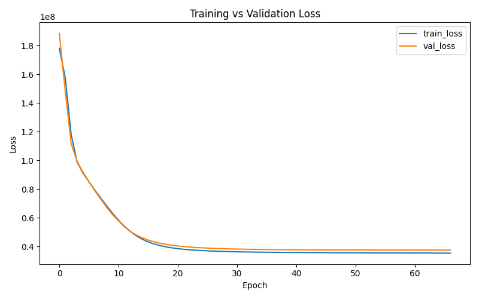
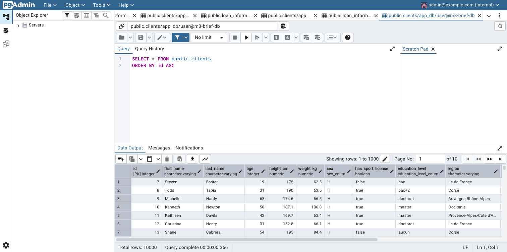

# Loan Management API

Projet réalisé avec FastAPI, SQLAlchemy, PostgreSQL et TensorFlow pour modéliser des clients, leurs informations de prêt, puis entraîner un réseau de neurones pour prédire `loan_amount`.

## Objectifs

- modéliser les données métier avec SQLAlchemy ORM
- exposer une API REST documentée automatiquement avec Swagger
- importer et nettoyer un jeu de données CSV dans PostgreSQL
- entraîner un modèle de réseau de neurones sur les données stockées en base

## Stack technique

- Python 3.11
- FastAPI
- SQLAlchemy
- Alembic
- PostgreSQL
- pgAdmin
- Pandas
- Scikit-learn
- TensorFlow / Keras
- Matplotlib

## Structure du projet

```text
.
├── api/
│   └── routes/
├── artifacts/
├── config/
├── data/
├── migrations/
├── ml/
├── models/
├── schemas/
├── scripts/
├── docker-compose.yml
├── main.py
└── requirements.txt
```

## Modélisation

Le projet repose sur deux entités principales :

- `Client`
- `LoanInformation`

Relation :

- un client peut être lié à plusieurs `loan_informations`

Contraintes :

- `clients.id` : clé primaire
- `loan_informations.id` : clé primaire
- `loan_informations.client_id` : clé étrangère vers `clients.id`

## Lancement du projet

### 1. Installer les dépendances

```bash
pip install -r requirements.txt
```

### 2. Lancer PostgreSQL et pgAdmin

```bash
docker compose up -d
```

Accès pgAdmin :

- URL : `http://localhost:5050`
- Email : `admin@example.com`
- Mot de passe : `admin`

### 3. Appliquer les migrations

```bash
alembic upgrade head
```

### 4. Importer les données CSV

```bash
python -m scripts.import_raw_data
```

Le script :

- nettoie `data/raw_data.csv`
- supprime les lignes trop incomplètes
- supprime les lignes sans cible `montant_pret`
- impute certaines colonnes numériques par la médiane
- impute certaines colonnes catégorielles par la valeur la plus fréquente
- insère les données nettoyées dans PostgreSQL

### 5. Lancer l'API

```bash
uvicorn main:app --reload
```

Accès API :

- API : `http://127.0.0.1:8000`
- Swagger : `http://127.0.0.1:8000/docs`
- ReDoc : `http://127.0.0.1:8000/redoc`

## Routes principales

### Clients

- `GET /clients`
- `GET /clients/{client_id}`
- `POST /clients`
- `DELETE /clients/{client_id}`

### Loan informations

- `GET /loan_informations`
- `GET /loan_informations/{loan_information_id}`
- `DELETE /loan_informations/{loan_information_id}`

## Entraînement du modèle

Le modèle prédit :

- `loan_amount`

### Lancer l'entraînement

```bash
python -m ml.train
```

### Artefacts générés

- `artifacts/loan_amount_model.keras`
- `artifacts/metrics.json`
- `artifacts/loss_curve.png`
- `artifacts/pgadmin.png`

### Métriques obtenues

- `train_loss`: `35271868.0`
- `val_loss`: `37457584.0`
- `test_loss`: `38544268.0`
- `test_mae`: `3987.509033203125`

## Captures

### Courbe de loss



### pgAdmin



## Remarques

- `date_of_birth` est laissé vide lors de l'import du CSV brut
- l'âge est utilisé comme variable présente dans les données
